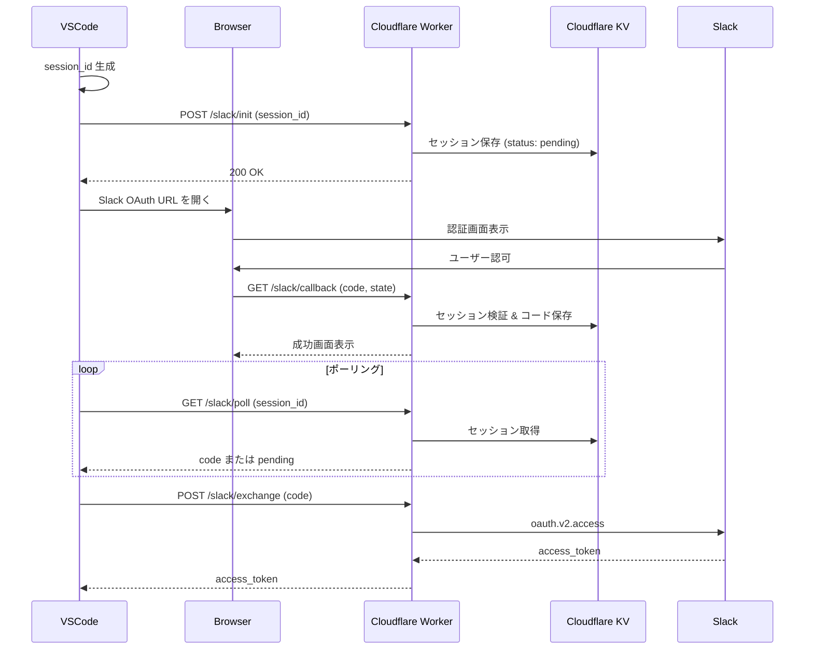

# CLAUDE.md

cc-wf-studio-connectors の開発ガイド。

## プロジェクト概要

cc-wf-studio（VSCode拡張）の Slack 連携用 OAuth 認証サーバー。Cloudflare Workers で稼働。

## 技術スタック

- **Runtime**: Cloudflare Workers
- **Language**: TypeScript
- **Package Manager**: pnpm (workspace)
- **Build**: Turborepo
- **Linter/Formatter**: Biome
- **Storage**: Cloudflare KV

## ディレクトリ構成

```
src/                    # Worker エントリーポイント
  index.ts              # メインエントリー
  router.ts             # ルーティング
  env.d.ts              # 環境変数型定義
packages/
  shared/               # 共通ユーティリティ
    src/
      kv/               # KV 操作
      utils/            # レスポンス、レート制限など
      templates/        # 法的ページテンプレート
  slack/                # Slack 連携
    src/
      init.ts           # セッション事前登録
      callback.ts       # OAuth コールバック
      poll.ts           # セッションポーリング
      exchange.ts       # トークン交換
      templates.ts      # HTML テンプレート
```

## コマンド

```bash
# 依存関係インストール
pnpm install

# ビルド
pnpm build

# ローカル開発
pnpm dev

# デプロイ
npx wrangler deploy

# Lint & Format
pnpm check
pnpm format
```

## Worker Secrets

デプロイ前に設定が必要：

```bash
npx wrangler secret put SLACK_CLIENT_ID
npx wrangler secret put SLACK_CLIENT_SECRET
```

## エンドポイント

| Path | Method | 説明 |
|------|--------|------|
| `/health` | GET | ヘルスチェック |
| `/slack/init` | POST | セッション事前登録 |
| `/slack/callback` | GET | OAuth コールバック |
| `/slack/poll` | GET | コードポーリング |
| `/slack/exchange` | POST | トークン交換 |
| `/privacy` | GET | プライバシーポリシー |
| `/terms` | GET | 利用規約 |

## OAuth フロー



## 関連リポジトリ

- [cc-wf-studio](https://github.com/breaking-brake/cc-wf-studio) - VSCode 拡張機能
