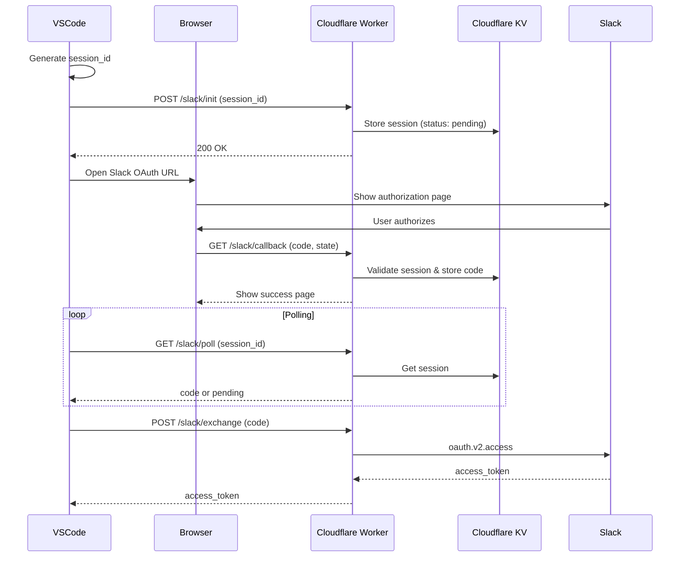

# cc-wf-studio-connectors

OAuth authentication server for [cc-wf-studio](https://github.com/breaking-brake/cc-wf-studio) (Slack integration).

## Overview

This Cloudflare Worker handles OAuth authentication for Slack, enabling the VSCode extension to securely connect to Slack workspaces.

## OAuth Flow



## Endpoints

| Endpoint | Method | Description |
|----------|--------|-------------|
| `/health` | GET | Health check |
| `/slack/init` | POST | Pre-register OAuth session |
| `/slack/callback` | GET | Slack OAuth callback |
| `/slack/poll` | GET | Poll for authorization code |
| `/slack/exchange` | POST | Exchange code for access token |
| `/privacy` | GET | Privacy Policy page |
| `/terms` | GET | Terms of Service page |

## Development

### Prerequisites

- Node.js 20+
- pnpm 9+
- Cloudflare account

### Setup

```bash
# Install dependencies
pnpm install

# Build all packages
pnpm build

# Run locally
pnpm dev
```

### Create KV Namespaces

Before deploying, create the required KV namespaces:

```bash
# Create namespaces
npx wrangler kv:namespace create "OAUTH_SESSIONS"
npx wrangler kv:namespace create "RATE_LIMIT"
```

Update `wrangler.toml` with the namespace IDs returned by the commands above.

### Set Worker Secrets

```bash
# Slack App credentials
npx wrangler secret put SLACK_CLIENT_ID
npx wrangler secret put SLACK_CLIENT_SECRET
```

### Deploy

```bash
npx wrangler deploy
```

## Configuration

### Worker Secrets

| Secret | Description |
|--------|-------------|
| `SLACK_CLIENT_ID` | Slack App Client ID |
| `SLACK_CLIENT_SECRET` | Slack App Client Secret |

### GitHub Secrets (for CI/CD)

| Secret | Description |
|--------|-------------|
| `CF_API_TOKEN` | Cloudflare API token with Workers edit permission |
| `CF_ACCOUNT_ID` | Cloudflare account ID |

### Custom Domain

To use a custom domain, configure it in the Cloudflare Dashboard:

1. Go to Workers & Pages → your worker → Settings → Domains & Routes
2. Add a custom domain (e.g., `oauth.your-domain.com`)

## Related

- [cc-wf-studio](https://github.com/breaking-brake/cc-wf-studio) - VSCode extension

## License

MIT
